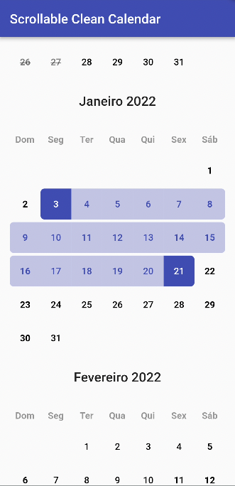
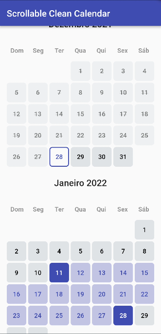

[](https://pub.dev/packages/scrollable_clean_calendar)


# Scrollable Clean Calendar

A clean calendar widget with vertical scroll, locale and range selection date.




## Contributors

<table>
  <tr>
    <td align="center">
      <a href="https://github.com/rodrigodobbin"></img><br><sub><b>Rodrigo Dobbin Fellows</b></sub>
    </td>
    <td align="center">
      <a href="https://github.com/EduardoNatale"></img><br><sub><b>Eduardo Natale</b></sub>
    </td>
    <td align="center">
      <a href="https://github.com/FabioFiuza"></img><br><sub><b>Fabio Fiuza</b></sub>
    </td>
    <td align="center">
      <a href="https://github.com/fpizzicol"></img><br><sub><b>Filippo Pizzicola</b></sub>
    </td>
    <td align="center">
      <a href="https://github.com/LucienCorreia"></img><br><sub><b>Lucian Risso Correia</b></sub>
    </td>
  </tr>
</table>

## Installation

Add

```bash
scrollable_clean_calendar: 1.4.1
```

to your `pubspec.yaml` and run

```bash
flutter pub get
```

in the project's main folder.

## Parameters

### ScrollableCleanCalendar

| Parameter                         | Type                                                                                                                                                                          | Default                                                 | Description                                                                                                                                                                                                                                                            |
| :-------------------------------- | :---------------------------------------------------------------------------------------------------------------------------------------------------------------------------- | :------------------------------------------------------ | :--------------------------------------------------------------------------------------------------------------------------------------------------------------------------------------------------------------------------------------------------------------------- |
| calendarController                | CleanCalendarController                                                                                                                                                       | **required**                                            | The controller of ScrollableCleanCalendar                                                                                                                                                                                                                              |
| locale                            | String                                                                                                                                                                        | en                                                      | The language locale                                                                                                                                                                                                                                                    |
| scrollController                  | ScrollController                                                                                                                                                              | null                                                    | Scroll controller, if you use this controller the Parameter `initialFocusDate` and the Functions `scrollToMonth` and `jumpToMonth` won't work since this override the scrollable list controller. Do not use them together or you will receive a nullPointer Exception |
| showWeekdays                      | bool                                                                                                                                                                          | true                                                    | If is to show or not the weekdays in calendar                                                                                                                                                                                                                          |
| layout                            | Layout                                                                                                                                                                        | null                                                    | What layout (design) is going to be used. **_Important: layout is required if you don't use all the layout builders_**                                                                                                                                                 |
| spaceBetweenMonthAndCalendar      | double                                                                                                                                                                        | 24                                                      | The space between month and calendar                                                                                                                                                                                                                                   |
| spaceBetweenCalendars             | double                                                                                                                                                                        | 24                                                      | The space between calendars                                                                                                                                                                                                                                            |
| initialFocusDate                  | DateTime                                                                                                                                                                      | null                                                    | Initial date that the calendar scroll should focus when open                                                                                                                                                                                                           |
| scrollToMonth                     | Function({required DateTime date, double alignment = 0, required Duration duration, Curve curve = Curves.linear, List\<double> opacityAnimationWeights = const [40, 20, 40]}) | null                                                    | Animate the list over `duration` using the given `curve` such that the item at `index` ends up with its leading edge at the given `alignment`.                                                                                                                         |
| jumpToMonth                       | Function ({required DateTime date, double alignment = 0})                                                                                                                     | null                                                    | Immediately, without animation, reconfigure the list so that the item at `index`'s leading edge is at the given `alignment`.                                                                                                                                           |
| calendarCrossAxisSpacing          | double                                                                                                                                                                        | 4                                                       | The horizontal space in the calendar dates                                                                                                                                                                                                                             |
| calendarMainAxisSpacing           | double                                                                                                                                                                        | 4                                                       | The vertical space in the calendar dates                                                                                                                                                                                                                               |
| padding                           | EdgeInsetsGeometry                                                                                                                                                            | EdgeInsets.symmetric(horizontal: 16, vertical: 32)      | The parent padding                                                                                                                                                                                                                                                     |
| monthTextStyle                    | TextStyle                                                                                                                                                                     | Theme.of(context).textTheme.headline6                   | The label text style of month                                                                                                                                                                                                                                          |
| monthTextAlign                    | TextAlign                                                                                                                                                                     | TextAlign.left                                          | The label text align of month                                                                                                                                                                                                                                          |
| weekdayTextStyle                  | TextStyle                                                                                                                                                                     | Theme.of(context).textTheme.bodyText1                   | The label text align of month                                                                                                                                                                                                                                          |
| dayTextStyle                      | TextStyle                                                                                                                                                                     | Theme.of(context).textTheme.bodyText1                   | The label text style of day                                                                                                                                                                                                                                            |
| daySelectedBackgroundColor        | Color                                                                                                                                                                         | Theme.of(context).colorScheme.primary                   | The day selected background color                                                                                                                                                                                                                                      |
| dayBackgroundColor                | Color                                                                                                                                                                         | Theme.of(context).colorScheme.surface                   | The day background color                                                                                                                                                                                                                                               |
| daySelectedBackgroundColorBetween | Color                                                                                                                                                                         | Theme.of(context).colorScheme.primary.withOpacity(.3)   | The day selected background color that is between day selected edges                                                                                                                                                                                                   |
| dayDisableBackgroundColor         | Color                                                                                                                                                                         | Theme.of(context).colorScheme.surface.withOpacity(.4)   | The day disable background color                                                                                                                                                                                                                                       |
| dayDisableColor                   | Color                                                                                                                                                                         | Theme.of(context).colorScheme.onSurface.withOpacity(.5) | The day disable color                                                                                                                                                                                                                                                  |
| dayRadius                         | double                                                                                                                                                                        | 6                                                       | The radius of day items                                                                                                                                                                                                                                                |
| monthBuilder                      | Widget Function(BuildContext context, String month)                                                                                                                           | null                                                    | A builder to make a customized month                                                                                                                                                                                                                                   |
| weekdayBuilder                    | Widget Function(BuildContext context, String weekday)                                                                                                                         | null                                                    | A builder to make a customized weekday                                                                                                                                                                                                                                 |
| dayBuilder                        | Widget Function(BuildContext context, DayValues values)                                                                                                                       | null                                                    | A builder to make a customized day of calendar                                                                                                                                                                                                                         |

### CleanCalendarController

| Parameter               | Type                                          | Default         | Description                                             |
| :---------------------- | :-------------------------------------------- | :-------------- | :------------------------------------------------------ |
| minDate                 | DateTime                                      | **required**    | Obrigatory: The mininimum date to show                  |
| maxDate                 | DateTime                                      | **required**    | Obrigatory: The maximum date to show                    |
| initialDateSelected     | DateTime                                      | null            | An initial selected date                                |
| endDateSelected         | DateTime                                      | null            | The end of selected range                               |
| weekdayStart            | int                                           | DateTime.monday | In what weekday position the calendar is going to start |
| onDayTapped             | Function(DateTime date)                       | null            | Function when a day is tapped                           |
| onRangeSelected         | Function(DateTime minDate, DateTime? maxDate) | null            | Function when a range is selected                       |
| onPreviousMinDateTapped | Function(DateTime date)                       | null            | When a date before the min date is tapped               |
| onAfterMaxDateTapped    | Function(DateTime date)                       | null            | When a date after max date is tapped                    |
| rangeMode               | bool                                          | true            | If the range is enabled                                 |
| readOnly                | bool                                          | false           | If the Calendar Widget is on read-only mode             |

## Layout.DEFAULT


```dart
ScrollableCleanCalendar(
  calendarController: calendarController,
  layout: Layout.DEFAULT,
),
```

## Layout.BEAUTY


```dart
ScrollableCleanCalendar(
  calendarController: calendarController,
  layout: Layout.BEAUTY,
  calendarCrossAxisSpacing: 0,
),
```
